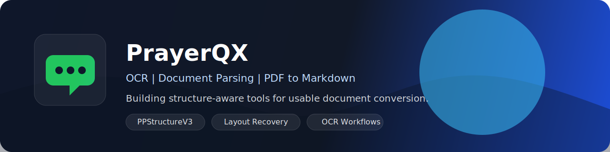

  

<h1 align="center">PrayerQX</h1>

  <strong>Python | OCR | Document Parsing | PDF to Markdown</strong>

  Building OCR and PDF-to-Markdown tools that preserve layout, tables, formulas, and reading order for search, RAG, and knowledge workflows.

  
  
  
  
  

## What I Build

- OCR pipelines for scanned and born-digital PDFs
- Structure-aware PDF to Markdown conversion
- Document recovery for titles, tables, formulas, images, and reading order
- Practical computer vision tools with usable interfaces and outputs

## Value

- Less manual cleanup after PDF parsing
- More reliable document outputs for search and RAG
- Better structure recovery on complex real-world files

## Tech Stack

  
  
  
  
  

  
  
  
  
  

  
  
  
  
  

## Featured Projects

### [PPStructureV3-PDF-to-Markdown](https://github.com/PrayerQX/PPStructureV3-PDF-to-Markdown)

`Python` `PPStructureV3` `OCR` `PDF` `Markdown`

A PPStructureV3-based PDF to Markdown project focused on recovering titles, tables, formulas, images, and reading order from complex documents.

### [yolov5-garbage-classification](https://github.com/PrayerQX/yolov5-garbage-classification)

`Python` `YOLOv5` `Computer Vision`

A computer vision project for garbage recognition and classification, built as a practical image understanding workflow.

## GitHub Activity

  
  

  

## Contact

If you are also working on OCR, document parsing, or PDF processing, feel free to connect through GitHub.
